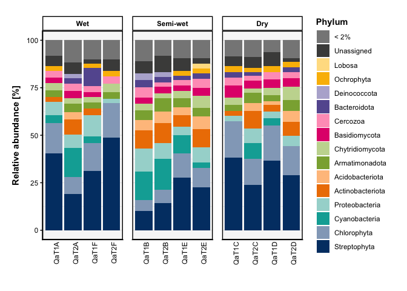
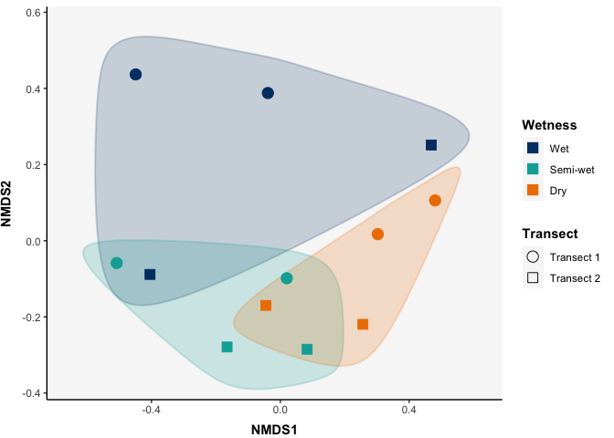

<!-- README.md is generated from README.Rmd. Please edit that file -->

# phyloENVS

<!-- badges: start -->
<!-- badges: end -->


The goal of phyloENVS is to provide tailored tools for visualizing and
analyzing microbial community data, with a focus on rRNA and mRNA
datasets from environmental samples such as soil, ice, and other
ecosystems. Built to enhance the functionality of the phyloseq package,
it offers customizable and publication-quality visualizations, including
ordination, abundance and richness plots for community composition
analysis. The package is designed to streamline workflows for
researchers within the Environmental Microbiology section at Department
of Environmental Science at Aarhus University.

## Installation

You can install the phyloENVS from [GitHub](https://github.com/) with
the devtools package.

``` r
# install.packages("devtools")
devtools::install_github("johanneBiO/phyloENVS")
```

## Example

This is a basic example which shows how you can visualize the relative
abundance for a microbial community. The data used comes from ice
sampled at the Qaanaaq glacier and at the Greenland ice sheet. We subset
the data and only look at transect samples from the Qaanaaq glacier.

``` r
library(phyloENVS)

data("qaanaaq_rRNA")

qaanaaq_rRNA_sub <- subset_samples(qaanaaq_rRNA,
                                   Transect != "Non-transect") 

vis_abundance(physeq = qaanaaq_rRNA_sub,
              group_x = SampleName,
              group_split = Wetness,
              level_glom = Phylum,
              level_select = NULL,
              group_select = NULL,
              lower_limit = 2,
              remove_grid = FALSE)
```

<div class="figure">


<p class="caption">
Relative abundance plot.
</p>

</div>

NMDS (Non-metric Multidimensional Scaling) is a popular technique used
for visualizing and interpreting the relationships between samples in
high-dimensional datasets. We can look into how different samples
cluster based on the available metadata, e.g., wetness.

``` r
vis_nmds(qaanaaq_rRNA_sub,
         convert_to_rel = TRUE,
         group_color = Wetness,
         group_shape = Transect,
         encircle = TRUE,
         fill_circle = TRUE,
         scale_circle = 0.09)
```

<div class="figure">


<p class="caption">
NMDS plot.
</p>

</div>
