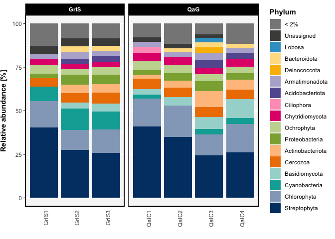

<!-- README.md is generated from README.Rmd. Please edit that file -->

# phyloENVS

<!-- badges: start -->
<!-- badges: end -->

The goal of phyloENVS is to provide tailored tools for visualizing and
analyzing microbial community data, with a focus on rRNA and mRNA
datasets from environmental samples such as soil, ice, and other
ecosystems. Built to enhance the functionality of the ‘phyloseq’
package, it offers customizable and publication-quality visualizations,
including abundance plots, diversity metrics, and community composition
analyses. The package is designed to streamline workflows for
researchers within Environmental Microbiology at Aarhus University.

## Installation

You can install the phyloENVS from [GitHub](https://github.com/) with
the devtools package.

``` r
# install.packages("devtools")
devtools::install_github("johanneBiO/phyloENVS")
```

## Example

This is a basic example which shows you can visualize the relative
abundance for a microbial community of ice sampled at the Qaanaaq
glacier and the Greenland ice sheet:

``` r
library(phyloENVS)

data("qaanaaq_rRNA")

qaanaaq_rRNA_sub <- subset_samples(qaanaaq_rRNA,
                                   Transect == "Non-transect") 

vis_abundance(physeq = qaanaaq_rRNA_sub,
              group_x = SampleName,
              group_split = Location,
              level_glom = Phylum,
              level_select = NULL,
              group_select = NULL,
              lower_limit = 2,
              remove_grid = FALSE)
```


