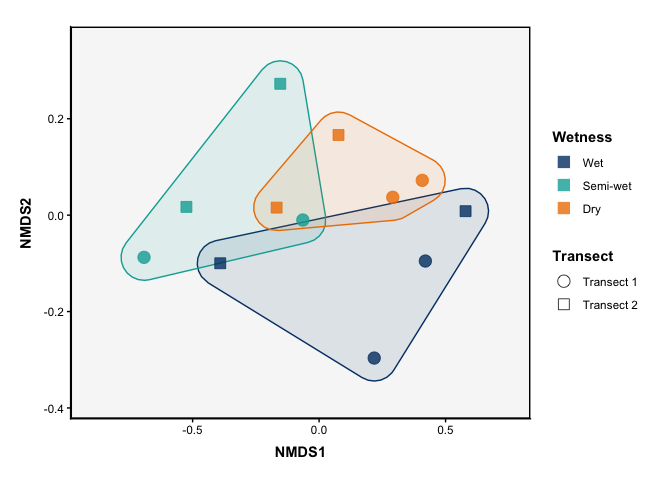

<!-- README.md is generated from README.Rmd. Please edit that file -->

# phyloENVS

<!-- badges: start -->
<!-- badges: end -->

The goal of phyloENVS is to provide tailored tools for visualizing and
analyzing microbial community data, with a focus on rRNA and mRNA
datasets from environmental samples such as soil, ice, and other
ecosystems. Built to enhance the functionality of the ‘phyloseq’
package, it offers customizable and publication-quality visualizations,
including abundance plots, diversity metrics, and community composition
analyses. The package is designed to streamline workflows for
researchers within Environmental Microbiology at Aarhus University.

## Installation

You can install the phyloENVS from [GitHub](https://github.com/) with
the devtools package.

``` r
# install.packages("devtools")
devtools::install_github("johanneBiO/phyloENVS")
```

## Example

This is a basic example which shows you can visualize the relative
abundance for a microbial community of ice sampled at the Qaanaaq
glacier and the Greenland ice sheet. We subset the data and only look at
transect samples from the Qaanaaq glacier.

``` r
library(phyloENVS)

data("qaanaaq_rRNA")

qaanaaq_rRNA_sub <- subset_samples(qaanaaq_rRNA,
                                   Transect != "Non-transect") 

vis_abundance(physeq = qaanaaq_rRNA_sub,
              group_x = SampleName,
              group_split = Wetness,
              level_glom = Phylum,
              level_select = NULL,
              group_select = NULL,
              lower_limit = 2,
              remove_grid = FALSE)
```

<div class="figure">


<p class="caption">
Relative abundance plot.
</p>

</div>

NMDS (Non-metric Multidimensional Scaling) plot is a popular technique
used for visualizing and interpreting the relationships between
sampleshigh-dimensional datasets. We can look into how different samples
cluster based on the available metadata, e.g., as location.

    #> Wisconsin double standardization
    #> Run 0 stress 0.07476995 
    #> Run 1 stress 0.07476995 
    #> ... New best solution
    #> ... Procrustes: rmse 3.480421e-06  max resid 7.179541e-06 
    #> ... Similar to previous best
    #> Run 2 stress 0.2675381 
    #> Run 3 stress 0.07476995 
    #> ... Procrustes: rmse 1.507615e-06  max resid 2.356424e-06 
    #> ... Similar to previous best
    #> Run 4 stress 0.07476995 
    #> ... New best solution
    #> ... Procrustes: rmse 1.73502e-06  max resid 3.817573e-06 
    #> ... Similar to previous best
    #> Run 5 stress 0.1434939 
    #> Run 6 stress 0.07476995 
    #> ... New best solution
    #> ... Procrustes: rmse 6.885777e-07  max resid 1.305142e-06 
    #> ... Similar to previous best
    #> Run 7 stress 0.147315 
    #> Run 8 stress 0.07476995 
    #> ... Procrustes: rmse 6.44407e-07  max resid 1.243743e-06 
    #> ... Similar to previous best
    #> Run 9 stress 0.07476995 
    #> ... Procrustes: rmse 1.530667e-06  max resid 3.531149e-06 
    #> ... Similar to previous best
    #> Run 10 stress 0.07476995 
    #> ... Procrustes: rmse 5.056707e-07  max resid 1.102092e-06 
    #> ... Similar to previous best
    #> Run 11 stress 0.07476995 
    #> ... Procrustes: rmse 1.072651e-06  max resid 2.126593e-06 
    #> ... Similar to previous best
    #> Run 12 stress 0.07476995 
    #> ... Procrustes: rmse 2.092849e-06  max resid 4.714503e-06 
    #> ... Similar to previous best
    #> Run 13 stress 0.147315 
    #> Run 14 stress 0.07476995 
    #> ... Procrustes: rmse 6.321442e-07  max resid 1.101485e-06 
    #> ... Similar to previous best
    #> Run 15 stress 0.07476995 
    #> ... Procrustes: rmse 2.754677e-06  max resid 4.879886e-06 
    #> ... Similar to previous best
    #> Run 16 stress 0.07476995 
    #> ... Procrustes: rmse 1.863296e-06  max resid 3.385304e-06 
    #> ... Similar to previous best
    #> Run 17 stress 0.335923 
    #> Run 18 stress 0.07476995 
    #> ... Procrustes: rmse 8.903885e-07  max resid 1.530193e-06 
    #> ... Similar to previous best
    #> Run 19 stress 0.07476995 
    #> ... Procrustes: rmse 4.011539e-06  max resid 7.983656e-06 
    #> ... Similar to previous best
    #> Run 20 stress 0.07476995 
    #> ... Procrustes: rmse 2.264993e-06  max resid 6.019919e-06 
    #> ... Similar to previous best
    #> *** Best solution repeated 12 times
    #> Scale for colour is already present.
    #> Adding another scale for colour, which will replace the existing scale.

<div class="figure">


<p class="caption">
NMDS plot.
</p>

</div>
