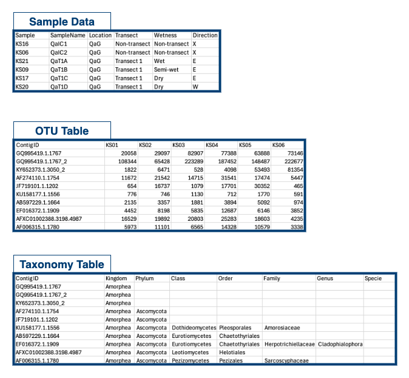

```{r, include = FALSE}
knitr::opts_chunk$set(
  collapse = TRUE,
  comment = "#>"
)
```

This vignette demonstrates the core functions of phyloENVS using totalRNA meta-transcriptomic data from ice samples collected in Qaanaaq, Greenland. The dataset includes samples from both the Qaanaaq Glacier and the Greenland Ice Sheet. In this vignette, we focus only on glacier samples collected along two transects.

As phyloENVS builds upon the phyloseq package for microbial community analysis, we assume that users are familiar with basic phyloseq commands. If you are new to phyloseq, we recommend reviewing [its documentation](https://joey711.github.io/phyloseq/) before proceeding. Below is the data structure for this specific examples.



Be aware, you can create a phyloseq object with phyloENVS using `data_to_phyloseq()` for TotalRNA meta-transcriptomic data obtained by the [ENVS pipeline](https://github.com/AU-ENVS-Bioinformatics/TotalRNA-Snakemake). See documentation with `?data_to_phyloseq()`.

## Sampling Design and Environmental Conditions

The transects were established on the Qaanaaq Glacier, with small melt water rivers on either side. Due to variations in water influence across the glacier surface, the sampling locations along each transect were categorized into three zones:

-   Wet Zone – Closest to the melt water rivers, experiencing the highest water flow.
-   Semi-Wet Zone – Intermediate locations, receiving occasional water input but not as saturated as the wet zone.
-   Dry Zone – Farthest from the water source with minimal direct melt water influence, representing more stable glacial ice conditions.

By comparing microbial communities across these zones, we can explore how water availability shapes microbial activity and composition on glacier surfaces.

Let's get started!

```{r setup}
library(phyloENVS)
library(phyloseq)
library(dplyr)
library(tidyr)

data("qaanaaq_rRNA")

qaanaaq_rRNA_sub <- phyloseq::subset_samples(qaanaaq_rRNA,
                                             Transect != "Non-transect") 
```

## Ordination

Firstly, we will perform Non-metric Multidimensional Scaling (NMDS) - a statistical method used for visualizing high-dimensional data by reducing it to fewer dimensions. This ordination will preserve the rank order of Bray-Curtis dissimilarities between samples. By coloring and encircle the points by wetness, we can visually investigate whether environmental factors seem to influence the composition of the community. We will shape the points by transect (1 or 2) to also look for patterns related to each transect.

```{r, message=FALSE, fig.width=7, fig.height=5, out.width="80%", fig.align="center"}
vis_nmds(physeq = qaanaaq_rRNA_sub,
         group_color = "Wetness",
         group_shape = "Wetness",
         encircle = TRUE,
         fill_circle = TRUE,
         smooth_circle = 0.05,
         scale_circle = 0.05,
         scale_plot = 0.2,
         circle_edge_size = 0)
```

Be aware, if the read counts are not normalized, we always recommend to normalize to the relative abundance prior to ordination (`convert_to_rel = TRUE`). This will be the default behavior of most functions. However, the user might prefer another normalization method or use relative abundances as input, e.g., when filtering out low abundance taxa based on relative abundances.

After generating the NMDS, we plot the Shepard plot to check the goodnees of fit for the ordination method. The Shepard plot compares the original dissimilarities between samples with the dissimilarities between samples in the reduced-dimensional space obtained from NMDS.

```{r, message=FALSE, fig.width=7, fig.height=5, out.width="80%", fig.align="center"}
vis_shepard(physeq = qaanaaq_rRNA_sub)
```

## Abundance

Relative abundance refers to the proportion of each taxon relative to the total number of reads in a sample, allowing for easy comparison across samples with varying sequencing depths. Again, we will focus on the relative abundances of microbial taxa from our dataset in wet, semi-wet, and dry zones.

```{r, fig.width=7, fig.height=5, out.width="80%", fig.align="center"}
vis_abundance(physeq = qaanaaq_rRNA_sub,
              group_x = "SampleName",
              group_split = "Wetness",
              level_glom = "Phylum",
              lower_limit = 2)
```

For `vis_abundance()`, it is possible to plot the relative abundance for a specific group within a specific level, e.g., only looking at *Streptophyta*.

```{r, fig.width=7, fig.height=5, out.width="80%", fig.align="center"}
vis_abundance(physeq = qaanaaq_rRNA_sub,
              group_x = "SampleName",
              group_split = "Wetness",
              level_glom = "Phylum",
              level_select = "Phylum",
              group_select = "Streptophyta",
              lower_limit = 0.5)
```

When looking into the relative abundance for a specific phyla, it might be useful to change the level to agglomerate counts, e.g., on order level. Below, we take a look at the orders represented among *Chytridiomycota*.

```{r, fig.width=7, fig.height=5, out.width="80%", fig.align="center"}
vis_abundance(physeq = qaanaaq_rRNA_sub,
              group_x = "SampleName",
              group_split = "Wetness",
              level_glom = "Order",
              level_select = "Phylum",
              group_select = "Chytridiomycota",
              lower_limit = 0)
```

## Alpha diversity

Alpha diversity can be measured with different metrics considering aspects like species richness (number of species) and evenness (distribution of abundances). This is crucial for understanding community structure and the complexity of ecosystems. With the function below, we look at the distribution of the Shannon and the inverse Simpson's index across samples grouped by their wetness. Other measures can be specified (see the supported methods with `?vis_richness()`).

```{r, fig.width=7, fig.height=5, out.width="80%", fig.align="center"}
vis_richness(physeq = qaanaaq_rRNA_sub, 
             group_x = "Wetness", 
             group_color = "Wetness")
```

## Statistics

PERMANOVA stands for Permutational Multivariate Analysis of Variance. It's a non-parametric statistical test used to assess whether the centroids (average positions) of the community composition in multivariate space differ significantly based on one or more factors. This test can be performed for multiple designs. The results are saved in a combined result file in Excel using `perform_permanova()`. 

```{r, eval=FALSE}
set.seed(123)

perform_permanova(qaanaaq_rRNA_sub,
                  stats_path = "results/",
                  designs = c("Direction", "Wetness"))
```

Be aware, a random seed should be set prior to running PERMANOVA to ensure that results were reproducible, as the method relies on random permutations to assess statistical significance. For making pairwise PERMANOVA, use `perform_permanova_pairwise()`. This will also include the overall PERMANOVA test.
